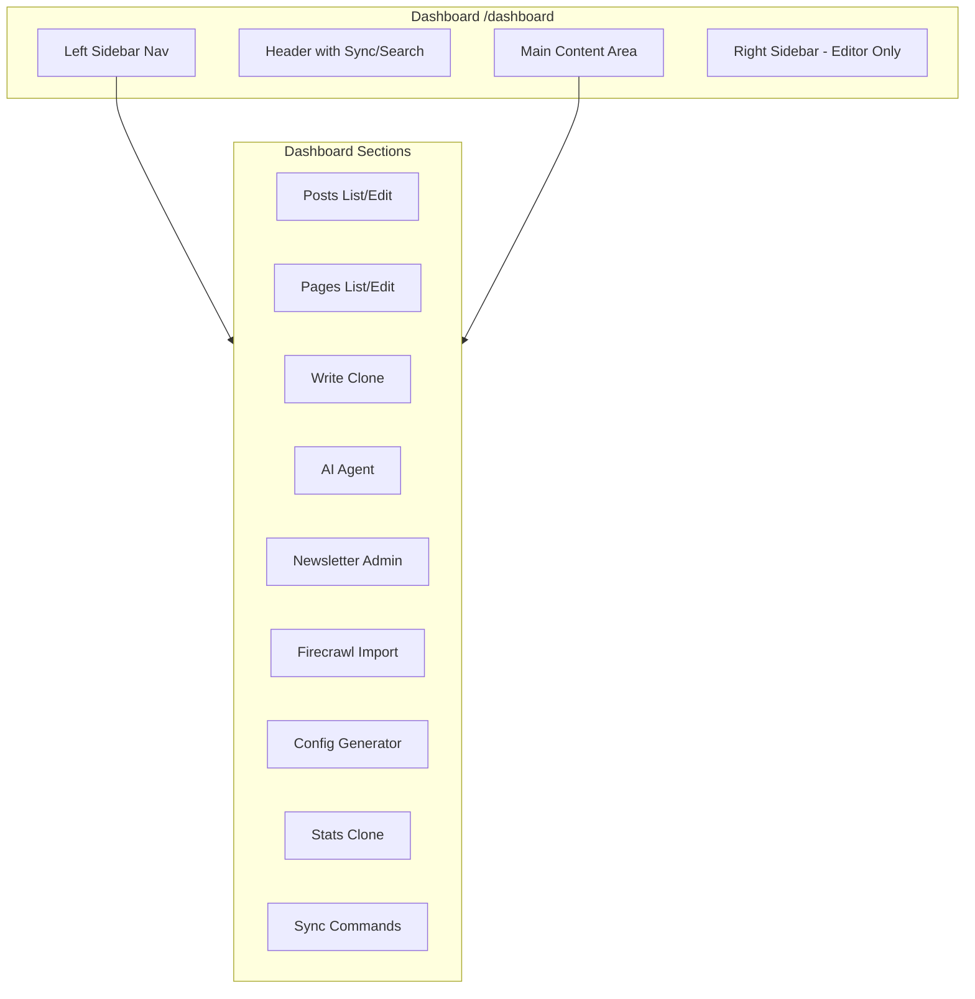

# Admin Dashboard Implementation Plan

## Architecture Overview



## Key Decisions

| Feature | Approach | Rationale |

| ---------------- | ------------------------------ | ------------------------------------------------------ |

| Content Editing | Generate downloadable markdown | Keeps markdown files as source of truth, safe workflow |

| Config Editing | Config generator UI | Visual form outputs TypeScript code for siteConfig.ts |

| Newsletter Admin | Move into dashboard | Consolidates admin features |

| Sync Commands | Copy-to-clipboard buttons | Safe, uses existing CLI scripts |

---

## Phase 1: Dashboard Foundation

**Goal:** Create the base dashboard layout with navigation structure

**Files to create/modify:**

- Create [`src/pages/Dashboard.tsx`](src/pages/Dashboard.tsx) - Main dashboard component
- Create [`src/components/dashboard/DashboardLayout.tsx`](src/components/dashboard/DashboardLayout.tsx) - Layout wrapper
- Create [`src/components/dashboard/DashboardSidebar.tsx`](src/components/dashboard/DashboardSidebar.tsx) - Left sidebar navigation
- Create [`src/components/dashboard/DashboardHeader.tsx`](src/components/dashboard/DashboardHeader.tsx) - Header with sync buttons and search
- Modify [`src/App.tsx`](src/App.tsx) - Add /dashboard route
- Add dashboard styles to [`src/styles/global.css`](src/styles/global.css)

**Key patterns to follow:**

- Use existing Write.tsx sidebar structure as template
- Use Phosphor icons (primary), Lucide (backup)
- Match existing theme CSS variables

---

## Phase 2: Posts & Pages List Views

**Goal:** WordPress-style list views with edit/view/publish actions

**Files to create/modify:**

- Create [`src/components/dashboard/PostsList.tsx`](src/components/dashboard/PostsList.tsx) - Posts list with actions
- Create [`src/components/dashboard/PagesList.tsx`](src/components/dashboard/PagesList.tsx) - Pages list with actions
- Create [`convex/dashboard.ts`](convex/dashboard.ts) - Dashboard queries (getAllPostsAdmin, getAllPagesAdmin, togglePublished)

**Features:**

- Table/list view with columns: Title, Date, Edit, View, Published
- Click row to edit
- Pagination (Prev/Next)
- Published toggle (updates Convex, requires re-sync to persist to markdown)

---

## Phase 3: Post/Page Editor View

**Goal:** Markdown editor with live preview and frontmatter sidebar

**Files to create/modify:**

- Create [`src/components/dashboard/ContentEditor.tsx`](src/components/dashboard/ContentEditor.tsx) - Main editor component
- Create [`src/components/dashboard/MarkdownPreview.tsx`](src/components/dashboard/MarkdownPreview.tsx) - Live preview renderer
- Create [`src/components/dashboard/FrontmatterEditor.tsx`](src/components/dashboard/FrontmatterEditor.tsx) - Right sidebar form
- Create [`src/utils/frontmatterParser.ts`](src/utils/frontmatterParser.ts) - Parse/generate frontmatter

**Features:**

- Toggle between "Markdown view" and "Live view"
- Right sidebar with all frontmatter fields (from POST_FIELDS/PAGE_FIELDS in Write.tsx)
- "Copy Markdown" button - copies full file with frontmatter
- "Download File" button - downloads as .md file
- Image path helper (shows available images in /public/images)

---

## Phase 4: Config Generator

**Goal:** Visual form to generate siteConfig.ts code

**Files to create/modify:**

- Create [`src/components/dashboard/ConfigGenerator.tsx`](src/components/dashboard/ConfigGenerator.tsx) - Main config form
- Create [`src/components/dashboard/ConfigSection.tsx`](src/components/dashboard/ConfigSection.tsx) - Reusable section component
- Create [`src/utils/configCodeGenerator.ts`](src/utils/configCodeGenerator.ts) - Generate TypeScript code

**Features:**

- Form sections for each siteConfig area (basic info, blog page, footer, newsletter, etc.)
- Pre-populated with current siteConfig values
- Live TypeScript code preview
- "Copy Config" button
- Instructions for saving to siteConfig.ts

---

## Phase 5: Newsletter Admin Migration

**Goal:** Move NewsletterAdmin.tsx functionality into dashboard

**Files to modify:**

- Integrate existing [`src/pages/NewsletterAdmin.tsx`](src/pages/NewsletterAdmin.tsx) features
- Create [`src/components/dashboard/NewsletterSection.tsx`](src/components/dashboard/NewsletterSection.tsx) - Container for newsletter features

**Subsections:**

- Subscribers (All, Active, Unsubscribed)
- Send Post
- Write Email
- Recent Sends
- Email Stats

---

## Phase 6: Import UI (Firecrawl)

**Goal:** UI for importing external URLs as markdown posts

**Files to create/modify:**

- Create [`src/components/dashboard/ImportSection.tsx`](src/components/dashboard/ImportSection.tsx) - Import UI
- Create [`convex/import.ts`](convex/import.ts) - Import action using Firecrawl

**Features:**

- URL input field
- "Import" button triggers Firecrawl scrape
- Preview imported content with generated frontmatter
- Edit before copying/downloading
- Uses existing pattern from `scripts/import-url.ts`

---

## Phase 7: Stats Clone

**Goal:** Dashboard version of Stats page

**Files to create/modify:**

- Create [`src/components/dashboard/StatsSection.tsx`](src/components/dashboard/StatsSection.tsx) - Stats display

**Features:**

- Clone Stats.tsx functionality
- Same real-time stats (active visitors, total views, etc.)
- Visitor map (if enabled)
- Does not follow siteConfig.statsPage settings (always visible in dashboard)

---

## Phase 8: Sync Section

**Goal:** UI for all sync commands

**Files to create/modify:**

- Create [`src/components/dashboard/SyncSection.tsx`](src/components/dashboard/SyncSection.tsx) - Sync commands UI

**Commands to expose:**

- `npm run sync` - Sync to dev
- `npm run sync:prod` - Sync to production
- `npm run sync:all` - Sync posts, pages, and discovery files (dev)
- `npm run sync:all:prod` - Sync all to production

**Features:**

- Button for each command (copies to clipboard)
- Description of what each command does
- Link to terminal instructions

---

## Phase 9: Write & Agent Clone

**Goal:** Clone Write.tsx and AI Agent into dashboard sections

**Files to create/modify:**

- Create [`src/components/dashboard/WriteSection.tsx`](src/components/dashboard/WriteSection.tsx) - Write page clone
- Create [`src/components/dashboard/AgentSection.tsx`](src/components/dashboard/AgentSection.tsx) - AI chat section

**Features:**

- Write section: Full Write.tsx functionality (template generation, frontmatter reference)
- Agent section: AIChatView with "write-dashboard" context
- Both work independently from main /write page

---

## Phase 10: Search & Polish

**Goal:** Dashboard search, mobile optimization, final polish

**Files to modify:**

- Add search functionality to DashboardHeader
- Ensure all dashboard components are mobile responsive
- Run TypeScript type checks
- Test all themes (dark, light, tan, cloud)

**Search scope:**

- Post/page titles and content
- Dashboard section names
- Config field names

---

## File Structure Summary

```
src/
├── pages/
│   └── Dashboard.tsx                 # Main dashboard page
├── components/
│   └── dashboard/
│       ├── DashboardLayout.tsx       # Layout wrapper
│       ├── DashboardSidebar.tsx      # Left nav
│       ├── DashboardHeader.tsx       # Header with sync/search
│       ├── PostsList.tsx             # Posts list view
│       ├── PagesList.tsx             # Pages list view
│       ├── ContentEditor.tsx         # Markdown editor
│       ├── MarkdownPreview.tsx       # Live preview
│       ├── FrontmatterEditor.tsx     # Right sidebar form
│       ├── ConfigGenerator.tsx       # Config UI
│       ├── ConfigSection.tsx         # Config form section
│       ├── NewsletterSection.tsx     # Newsletter admin
│       ├── ImportSection.tsx         # Firecrawl import
│       ├── StatsSection.tsx          # Stats clone
│       ├── SyncSection.tsx           # Sync commands
│       ├── WriteSection.tsx          # Write clone
│       └── AgentSection.tsx          # AI chat
├── utils/
│   ├── frontmatterParser.ts          # Frontmatter utilities
│   └── configCodeGenerator.ts        # Config code generation
convex/
├── dashboard.ts                      # Dashboard queries/mutations
└── import.ts                         # Firecrawl import action
```

---

## Implementation Notes

1. **No breaking changes** - Existing pages (/write, /newsletter-admin, /stats) continue to work
2. **Convex patterns** - Use indexed queries, idempotent mutations, avoid write conflicts
3. **Theme support** - All components use CSS variables from global.css
4. **Mobile first** - All components responsive across breakpoints
5. **Type safety** - Full TypeScript with Convex validators
6. **Login placeholder** - Bottom left link, no auth implementation yet
