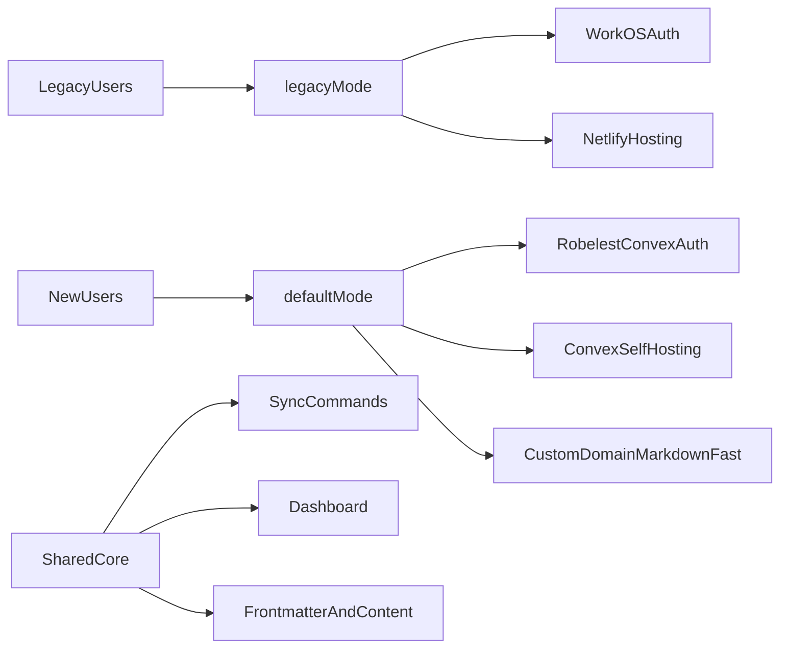

# Migration plan: robelest auth + Convex self hosting with legacy compatibility

## Goals and constraints

- Move primary auth to `@robelest/convex-auth` and primary hosting to `@convex-dev/self-hosting`.
- Keep existing users working if they stay on Netlify and WorkOS.
- Keep markdown sync, discovery sync, dashboard content workflows, and frontmatter behavior unchanged.
- Keep forkability high by updating scaffolding defaults and preserving legacy options.
- Keep rollout safe: security hardening first, migration second.

## Current state checkpoints

- Auth is currently WorkOS-based in `[convex/auth.config.ts](/Users/waynesutton/Documents/sites/markdown-blog/convex/auth.config.ts)`, `[src/main.tsx](/Users/waynesutton/Documents/sites/markdown-blog/src/main.tsx)`, `[src/AppWithWorkOS.tsx](/Users/waynesutton/Documents/sites/markdown-blog/src/AppWithWorkOS.tsx)`, `[src/pages/Callback.tsx](/Users/waynesutton/Documents/sites/markdown-blog/src/pages/Callback.tsx)`, and `[src/pages/Dashboard.tsx](/Users/waynesutton/Documents/sites/markdown-blog/src/pages/Dashboard.tsx)`.
- Dashboard access is currently frontend-gated and not admin-role-based; there is no server-enforced dashboard admin model yet.
- Hosting is Netlify-first in `[netlify.toml](/Users/waynesutton/Documents/sites/markdown-blog/netlify.toml)` and `netlify/edge-functions/*`, with Convex HTTP endpoints in `[convex/http.ts](/Users/waynesutton/Documents/sites/markdown-blog/convex/http.ts)`.
- Convex self-hosting is not yet wired (`@convex-dev/self-hosting` not integrated, no `convex/staticHosting.ts`, no static route registration).
- Fork/bootstrap config is Netlify and WorkOS oriented in `[fork-config.json.example](/Users/waynesutton/Documents/sites/markdown-blog/fork-config.json.example)`, `[FORK_CONFIG.md](/Users/waynesutton/Documents/sites/markdown-blog/FORK_CONFIG.md)`, and `packages/create-markdown-sync/*`.
- Media uploads currently rely on optional ConvexFS/Bunny paths; R2 is not integrated and upload auth in HTTP routes still needs hardening.

## Phase 0: re-baseline and harden first

- Re-baseline all migration tasks against current documentation and inventory in `[files.md](/Users/waynesutton/Documents/sites/markdown-blog/files.md)`.
- Add immediate backend protections before auth/hosting migration:
  - enforce admin-only checks on dashboard-facing Convex functions.
  - lock down upload auth in `[convex/http.ts](/Users/waynesutton/Documents/sites/markdown-blog/convex/http.ts)` (remove permissive `return true` production path).
- Keep all existing routes and sync commands working while hardening is introduced.

## Migration architecture

## Phase 1: introduce dual-mode configuration surface

- Add a single compatibility contract in `[src/config/siteConfig.ts](/Users/waynesutton/Documents/sites/markdown-blog/src/config/siteConfig.ts)`:
  - `auth.mode`: `"convex-auth" | "workos" | "none"`
  - `hosting.mode`: `"convex-self-hosted" | "netlify"`
  - optional `compat.legacyDocs` toggle for docs rendering/linking.
- Add media provider contract:
  - `media.provider`: `"convex" | "convexfs" | "r2"` with safe fallback defaults.
- Keep `dashboard.requireAuth` semantics, mapping it to selected auth mode.
- Add environment variable compatibility mapping strategy:
  - New auth envs for robelest auth.
  - Keep WorkOS env keys recognized only when `auth.mode === "workos"`.

## Phase 2: backend auth migration to robelest

- Add Convex auth component wiring:
  - create `[convex/auth.ts](/Users/waynesutton/Documents/sites/markdown-blog/convex/auth.ts)`
  - update `[convex/convex.config.ts](/Users/waynesutton/Documents/sites/markdown-blog/convex/convex.config.ts)` to register auth component.
- Update `[convex/http.ts](/Users/waynesutton/Documents/sites/markdown-blog/convex/http.ts)` to call `auth.http.add(http)` and keep existing API/RSS/sitemap routes working.
- Add dashboard admin authorization model:
  - add a dedicated table and indexes in `[convex/schema.ts](/Users/waynesutton/Documents/sites/markdown-blog/convex/schema.ts)` for dashboard admin memberships.
  - add server-side auth helpers (for example in `convex/authAdmin.ts`) to resolve current user and verify admin status.
  - enforce admin checks in dashboard-facing queries/mutations, not just in frontend routing.
- Add bootstrap and maintenance commands for admin access:
  - create a mutation/internal mutation to grant admin by user id or email.
  - expose an explicit command for operators, for example:
    - `npx convex run authAdmin:grantDashboardAdmin -- '{\"email\":\"admin@example.com\"}'`
    - `npx convex run authAdmin:revokeDashboardAdmin -- '{\"email\":\"admin@example.com\"}'`
  - document first-admin bootstrap flow for fresh forks.
- Ensure this admin model works for both auth providers:
  - default robelest auth mode
  - legacy WorkOS auth mode.
- Preserve legacy WorkOS config file behavior:
  - keep `[convex/auth.config.ts](/Users/waynesutton/Documents/sites/markdown-blog/convex/auth.config.ts)` as legacy path with deprecation notes.
  - ensure no runtime conflict when both exist.
- Add migration-safe server checks so dashboard auth gates do not break when moving between providers.

## Phase 3: frontend auth abstraction and dashboard compatibility

- Replace direct WorkOS branching in `[src/main.tsx](/Users/waynesutton/Documents/sites/markdown-blog/src/main.tsx)` with provider-agnostic auth bootstrap.
- Replace/repurpose `[src/AppWithWorkOS.tsx](/Users/waynesutton/Documents/sites/markdown-blog/src/AppWithWorkOS.tsx)` into a generic auth wrapper with:
  - Convex Auth path (default)
  - WorkOS legacy path (when configured)
  - no-auth path.
- Refactor `[src/utils/workos.ts](/Users/waynesutton/Documents/sites/markdown-blog/src/utils/workos.ts)` into provider utilities while preserving old exports during transition.
- Update `[src/pages/Dashboard.tsx](/Users/waynesutton/Documents/sites/markdown-blog/src/pages/Dashboard.tsx)` access checks so:
  - only authenticated admins can view dashboard content.
  - non-admin authenticated users get an access denied state.
  - legacy WorkOS mode maps to the same admin check path (no open dashboard when auth is enabled).
- Keep `[src/pages/Callback.tsx](/Users/waynesutton/Documents/sites/markdown-blog/src/pages/Callback.tsx)` for WorkOS legacy mode only, and route new auth callback handling through robelest/Convex HTTP flow.

## Phase 4: self-hosted static delivery with Convex

- Install and wire `@convex-dev/self-hosting` with:
  - component registration in `[convex/convex.config.ts](/Users/waynesutton/Documents/sites/markdown-blog/convex/convex.config.ts)`
  - upload/query exports in new `[convex/staticHosting.ts](/Users/waynesutton/Documents/sites/markdown-blog/convex/staticHosting.ts)`
  - static route registration in `[convex/http.ts](/Users/waynesutton/Documents/sites/markdown-blog/convex/http.ts)`.
- Add deploy scripts in `[package.json](/Users/waynesutton/Documents/sites/markdown-blog/package.json)`:
  - one-shot self-hosted deploy
  - optional static-only upload
  - keep existing Netlify-oriented commands for legacy mode.
- Keep Netlify files intact during transition, but mark as legacy:
  - `[netlify.toml](/Users/waynesutton/Documents/sites/markdown-blog/netlify.toml)`
  - `netlify/edge-functions/*`
  - `[public/_redirects](/Users/waynesutton/Documents/sites/markdown-blog/public/_redirects)`.

## Phase 4b: media upload strategy for dashboard

- Keep `convex-fs` integration optional:
  - treat Bunny/ConvexFS as a feature flag, not a hard dependency for forks.
  - preserve existing behavior in `[convex/fs.ts](/Users/waynesutton/Documents/sites/markdown-blog/convex/fs.ts)` and `[convex/files.ts](/Users/waynesutton/Documents/sites/markdown-blog/convex/files.ts)` with explicit optional setup docs.
- Add Cloudflare R2 as an optional image storage backend for dashboard uploads:
  - integrate `@convex-dev/r2` component in `[convex/convex.config.ts](/Users/waynesutton/Documents/sites/markdown-blog/convex/convex.config.ts)` behind config toggle.
  - add R2 upload/query helpers in new `convex/r2.ts` and media abstraction helpers (for example `convex/media.ts`) to avoid coupling dashboard UI to a single provider.
  - add provider-specific environment variable docs and fork config options.
- Keep direct image upload supported as default/fallback for Convex-first self-hosted deployments:
  - ensure `[src/pages/Dashboard.tsx](/Users/waynesutton/Documents/sites/markdown-blog/src/pages/Dashboard.tsx)` upload flow can use:
    - direct Convex storage upload path
    - optional ConvexFS path
    - optional R2 path
  - expose provider selection via config in `[src/config/siteConfig.ts](/Users/waynesutton/Documents/sites/markdown-blog/src/config/siteConfig.ts)` (for example `media.provider`), with safe defaults for forks.
- Preserve backward compatibility for current media behavior:
  - existing Dashboard media library UX remains functional without forcing R2 or Bunny setup.
  - migrations should be additive with no required data rewrite for existing image references.
- Keep `convex-fs` explicitly optional:
  - do not block app startup or dashboard upload UI when Bunny/ConvexFS env vars are absent.
  - keep direct upload path as first-class default for forks.

## Phase 5: custom domain and DNS migration path

- Document and script deployment expectations for custom domain on Convex:
  - set custom domain in Convex deployment settings
  - override `CONVEX_CLOUD_URL` and optionally `CONVEX_SITE_URL`
  - redeploy with production build.
- Add Cloudflare DNS migration checklist in docs and fork guide:
  - DNS records required by Convex
  - SSL issuance timing expectations
  - rollback instructions to legacy host.
- Update default canonical/site URL references to `https://markdown.fast` where currently Netlify-specific.

## Phase 6: fork and package scaffolding updates

- Update fork schema and examples in `[fork-config.json.example](/Users/waynesutton/Documents/sites/markdown-blog/fork-config.json.example)` to include new `auth.mode` and `hosting.mode` defaults.
- Update `[scripts/configure-fork.ts](/Users/waynesutton/Documents/sites/markdown-blog/scripts/configure-fork.ts)` transforms to support new fields while preserving legacy keys (`githubUsername`, `githubRepo`, existing WorkOS toggles).
- Update CLI scaffolder in `packages/create-markdown-sync/src/*`:
  - wizard prompts for auth/hosting mode
  - generated defaults move to Convex self-hosted + robelest auth
  - legacy option remains selectable.
- Keep backward-compat transforms in place for at least one release cycle.

## Phase 7: docs split into default vs legacy

- Update core docs and agent docs to reflect new default architecture:
  - `[README.md](/Users/waynesutton/Documents/sites/markdown-blog/README.md)`
  - `[FORK_CONFIG.md](/Users/waynesutton/Documents/sites/markdown-blog/FORK_CONFIG.md)`
  - `[AGENTS.md](/Users/waynesutton/Documents/sites/markdown-blog/AGENTS.md)`
  - `[CLAUDE.md](/Users/waynesutton/Documents/sites/markdown-blog/CLAUDE.md)`
  - `[files.md](/Users/waynesutton/Documents/sites/markdown-blog/files.md)`
  - relevant `prds/*.md` you listed (especially WorkOS and Netlify specific guides).
- Add media backend documentation split:
  - default: direct Convex upload with self-hosting
  - optional: ConvexFS/Bunny
  - optional: Cloudflare R2 via `@convex-dev/r2`
  - include setup matrices and fallback behavior for forks.
- Refresh `files.md` to reflect final architecture accurately:
  - auth defaults and legacy mode
  - hosting defaults and legacy Netlify mode
  - dashboard admin-only behavior
  - media provider options and fallback behavior.
- Create explicit legacy sections:
  - "Legacy: Netlify hosting"
  - "Legacy: WorkOS dashboard auth"
  - migration steps from legacy to default.
- Keep `.claude` skill workflows valid, especially frontmatter and sync behavior, by documenting that auth/hosting changes do not alter frontmatter contracts or sync command interfaces.

## Phase 8: verification and release safety

- Validation matrix:
  - local dev with default mode
  - local dev with legacy mode
  - sync commands (`sync`, `sync:prod`, discovery variants)
  - dashboard auth states across all modes
  - dashboard role states: unauthenticated, authenticated non-admin, authenticated admin
  - admin grant/revoke command flow and first-admin bootstrap flow
  - dashboard image upload flows for all providers (direct Convex, ConvexFS optional, R2 optional)
  - media rendering/backward compatibility for previously uploaded assets
  - API/RSS/sitemap/raw/LLM endpoints
  - MCP endpoint in both hosting modes.
- Add release notes in `[changelog.md](/Users/waynesutton/Documents/sites/markdown-blog/changelog.md)` and execution log in `[TASK.md](/Users/waynesutton/Documents/sites/markdown-blog/TASK.md)`.
- Keep Netlify path functional until migration is declared complete, then plan separate deprecation PR.

## Upstream sources to lock before implementation

- Use `robelest/convex-auth` **release** branch semantics for stability unless explicitly overridden.
- Use latest `get-convex/self-hosting` integration guidance for route and deploy wiring.
- Use Convex custom domain guidance for `CONVEX_CLOUD_URL` and `CONVEX_SITE_URL` overrides.

## Deliverable sequencing

- PR 0: re-baseline + security hardening (admin checks + upload auth lock-down) with no provider switch.
- PR 1: dual-mode config + auth abstraction + no behavior change.
- PR 2: robelest auth integration default-on + admin bootstrap commands.
- PR 3: Convex self-hosting default-on + custom domain docs.
- PR 4: media provider abstraction (direct default + optional ConvexFS + optional R2).
- PR 5: fork/CLI/docs/files.md legacy split + migration guide.
- PR 6: optional cleanup/deprecation of legacy paths after adoption window.
