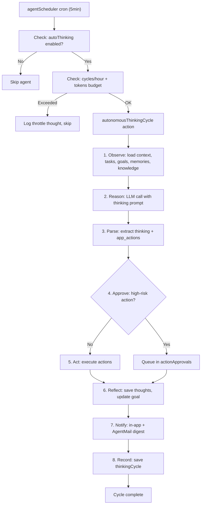

# Autonomous Thinking Mode (Full Plan)

This plan adds a self-directed cognitive loop to each user's agent. When "Auto Thinking" is toggled on, the agent runs autonomously: observing its environment, reasoning about goals, creating tasks, executing tools, and notifying the user of results via in-app notifications and AgentMail.

The plan also integrates a "never forgets" memory architecture: fact extraction from conversations, conflict resolution for contradictory information, LLM-powered memory synthesis, tiered retrieval with time decay, and access-based memory prioritization. This ensures the autonomous agent reasons from structured, current, prioritized knowledge rather than raw text fragments.

## Codebase audit checklist (run before each phase)

Before writing any code, verify these existing patterns are preserved:

- [convex/schema.ts](convex/schema.ts) -- all existing tables, indexes, validators unchanged
- [convex/agent/runtime.ts](convex/agent/runtime.ts) -- `processMessage` pipeline, `parseAgentActions`, `parseThinkingBlocks` unchanged
- [convex/crons.ts](convex/crons.ts) -- existing crons (heartbeat, scheduler, memory compression) unchanged
- [convex/functions/agentThinking.ts](convex/functions/agentThinking.ts) -- existing thinking queries/mutations preserved
- [src/pages/AgentsPage.tsx](src/pages/AgentsPage.tsx) -- existing thinking toggle (checkbox at ~~line 1419), scheduling section (~~line 1362), toggle switch pattern (~line 905) all preserved
- [src/pages/AgentThinkingPage.tsx](src/pages/AgentThinkingPage.tsx) -- existing read-only thinking timeline preserved
- [src/pages/AutomationPage.tsx](src/pages/AutomationPage.tsx) -- existing A2A + Thinking tabs preserved
- [convex/agent/securityUtils.ts](convex/agent/securityUtils.ts) -- security scanning + hardened system prompt unchanged
- [convex/functions/board.ts](convex/functions/board.ts) -- `createTaskFromAgent`, `updateTaskFromAgent` unchanged
- [convex/functions/credentials.ts](convex/functions/credentials.ts) -- BYOK credential flow unchanged

---

## Architecture: The Cognitive Loop



---

## Architecture: Never Forgets Memory System

The existing memory system stores raw conversations and retrieves by vector similarity. This upgrade adds structured fact extraction, conflict resolution, and intelligent retrieval so the agent builds real understanding over time.

```mermaid
flowchart TD
    subgraph write_path [Write Path: After Every Conversation]
        NewConvo["New conversation"] --> SaveRaw["Save raw to agentMemory (conversation)"]
        SaveRaw --> ExtractFacts["LLM extracts atomic facts"]
        ExtractFacts --> CheckConflict{"Conflict with existing fact?"}
        CheckConflict -->|Yes| Supersede["Archive old fact, save new with supersededBy metadata"]
        CheckConflict -->|No| SaveFact["Save as learned_preference with category"]
    end

    subgraph read_path [Read Path: Tiered Retrieval]
        Query["Agent needs context"] --> LoadPrefs["1. Load learned_preferences + user_profile summaries"]
        LoadPrefs --> Sufficient{"Sufficient for goal?"}
        Sufficient -->|Yes| Respond["Use as context"]
        Sufficient -->|No| VectorSearch["2. Vector search with time decay scoring"]
        VectorSearch --> StillNeed{"Still need more?"}
        StillNeed -->|Yes| RawSearch["3. Search raw conversation history"]
        StillNeed -->|No| Respond
        RawSearch --> Respond
    end

    subgraph maintenance [Maintenance Crons]
        NightlyJob["Nightly: extract missed facts, deduplicate"] --> WeeklyJob["Weekly: LLM-powered summary synthesis per category"]
        WeeklyJob --> MonthlyJob["Monthly: re-embed with latest model, archive dead memories"]
    end
```



### Existing gaps in current memory system

1. **No fact extraction**: `learned_preference` type exists in schema but is never written to. Raw conversations are stored but atomic facts are never extracted.
2. **No conflict resolution**: Vector search returns contradictory facts from different time periods with no way to determine which is current.
3. **Summaries are concatenation, not synthesis**: `memoryCompression` cron in [convex/crons.ts](convex/crons.ts) lines 177-181 joins snippets truncated to 220 chars. No LLM involvement.
4. **No tiered retrieval**: Always loads 10 chronological + 8 vector matches. No sufficiency check, no adaptive depth.
5. **No time decay**: Vector search returns 8 most similar results regardless of age. A 6-month-old memory ranks equal to yesterday's.
6. **No access tracking**: No `accessCount` or `lastAccessedAt` on memories. Cannot promote frequently accessed knowledge or identify stale data.

---

## Phase 1: Schema + Core Loop + Auto Thinking Toggle

### Schema additions in [convex/schema.ts](convex/schema.ts)

New tables:

- `**notifications` -- userId, agentId, type (thinking_update, task_completed, approval_needed, cycle_summary, system), title, content, channel (in_app, email, both), read, emailSent, createdAt. Indexes: `by_userId`, `by_userId_read`
- `**thinkingCycles` -- agentId, userId, goal, status (running, completed, failed, throttled), stepsCompleted, tokensUsed, actionsExecuted, actionsQueued, thoughtIds (array of agentThought IDs), startedAt, completedAt. Indexes: `by_agentId`, `by_agentId_status`
- `**actionApprovals` -- userId, agentId, cycleId (thinkingCycles), actionType, actionPayload (v.any()), riskLevel (low, medium, high), status (pending, approved, rejected, expired), reviewedAt, expiresAt, createdAt. Indexes: `by_userId_status`, `by_agentId`

Schema modification on `agentMemory` table (add new fields and types):

```typescript
// Extend existing type union:
type: v.union(
  v.literal("conversation"),           // existing
  v.literal("learned_preference"),     // existing but UNUSED -- wire it up
  v.literal("task_result"),            // existing
  v.literal("conversation_summary"),   // existing
  v.literal("user_profile"),           // NEW: synthesized profile per category
  v.literal("reflection"),             // NEW: agent self-reflection on performance
),
// NEW fields on agentMemory:
category: v.optional(v.string()),      // e.g. "work", "preferences", "health", "relationships"
accessCount: v.optional(v.number()),   // bumped each time memory is retrieved and injected
lastAccessedAt: v.optional(v.number()),// timestamp of last retrieval
supersededBy: v.optional(v.id("agentMemory")), // points to the newer fact that replaced this one
```

New index on agentMemory: `by_userId_type` on `["userId", "type"]` for efficient preference/profile lookups.

Schema modification on `agents` table thinking field:

```typescript
thinking: v.optional(
  v.object({
    enabled: v.boolean(), // existing: basic thinking on/off
    isPaused: v.boolean(), // existing
    currentGoal: v.optional(v.string()), // existing
    lastThought: v.optional(v.string()), // existing
    lastThoughtAt: v.optional(v.number()), // existing
    // NEW fields:
    autoThinking: v.optional(v.boolean()), // autonomous mode toggle
    maxCyclesPerHour: v.optional(v.number()), // default 6
    maxTokensPerCycle: v.optional(v.number()), // default 4096
  })
);
```

Schema modification on `users` table:

```typescript
notificationPreferences: v.optional(
  v.object({
    thinkingDigest: v.union(
      v.literal("realtime"),
      v.literal("hourly"),
      v.literal("daily"),
      v.literal("off")
    ),
    approvalAlerts: v.boolean(), // always notify on pending approvals
    emailEnabled: v.boolean(), // send via AgentMail when available
  })
);
```

### Core thinking loop in [convex/crons.ts](convex/crons.ts)

Modify `agentScheduler` to check `agent.thinking.autoThinking === true` separately from the existing task-processing path. When autoThinking is on, call a new `autonomousThinkingCycle` action.

### New file: [convex/functions/autonomousThinking.ts](convex/functions/autonomousThinking.ts)

`**autonomousThinkingCycle**` (internalAction):

1. Load agent context via existing `getAgentContext` + skills + knowledge graph
2. Check budget: query `thinkingCycles` for this agent in last hour, compare against `maxCyclesPerHour`
3. Build a "thinking prompt" that includes: current goal, recent thoughts, pending tasks, available skills, knowledge snippets
4. Call LLM via existing `callLLMProvider` pattern (reuse from runtime.ts, extract shared helper)
5. Parse response for `<thinking>` blocks and `<app_actions>`
6. For each action: classify risk level, route to execution or approval queue
7. Save thoughts to `agentThoughts` via existing `createThought`
8. Record cycle to `thinkingCycles`
9. Create notification(s) via new `createNotification` mutation

**Risk classification logic:**

- Low risk: create_task, create_knowledge_node, create_feed_item, link_knowledge_nodes
- Medium risk: update_task_status, update_skill, move_task, create_subtask
- High risk: delegate_to_agent, generate_image, generate_audio, call_tool, send_email

Low/medium: auto-execute. High: queue for approval.

### UI: Auto Thinking toggle in [src/pages/AgentsPage.tsx](src/pages/AgentsPage.tsx)

Add a new toggle switch (using the existing switch pattern from ~line 905) **below** the existing "Enable thinking mode" checkbox. The new toggle:

- Label: "Auto Thinking" with a subtitle "Agent reasons and acts on its own"
- Only visible when thinking mode is enabled
- Uses the pill-style switch pattern (not checkbox) to visually distinguish it from the basic thinking toggle
- Below the toggle: budget controls (cycles per hour slider, tokens per cycle input)
- Warning text when enabled: "Your agent will use LLM tokens automatically based on its schedule"

State: `editAutoThinking`, `editMaxCyclesPerHour`, `editMaxTokensPerCycle`

### Fact extraction in [convex/functions/autonomousThinking.ts](convex/functions/autonomousThinking.ts)

`**extractFacts` (internalAction): Runs after each conversation (scheduled by `processMessage` in runtime.ts) or during the autonomous thinking cycle observation step.

1. Load recent unprocessed conversations for the agent (last N messages without extracted facts)
2. Call LLM with extraction prompt: "Extract discrete facts from this conversation. Focus on preferences, behaviors, key details. Return as JSON array of `{ category, content }` items."
3. For each extracted fact:

- Query existing `learned_preference` entries for the same user + category using the new `by_userId_type` index
- If a conflicting fact exists (use LLM or embedding similarity to detect): archive the old one with `supersededBy` pointing to the new entry
- Insert new `learned_preference` with category, content, embedding, and `accessCount: 0`

1. Record extraction as a thought (type: "observation", content: "Extracted N facts from recent conversations")

**Conflict resolution logic:**

- When inserting a new `learned_preference`, search existing preferences in the same category
- Use embedding similarity > 0.85 to find potential conflicts (same topic, different content)
- Ask LLM: "Are these two facts about the same thing? Is the new one an update?"
- If yes: patch old fact with `archived: true, supersededBy: newId`
- This prevents the "loves job / hates job" contradiction problem

**New action type for app_actions:**

```typescript
type ExtractFactsAction = {
  type: "extract_facts";
  facts: Array<{ category: string; content: string; supersedes?: string }>;
};
```

This allows the autonomous agent to explicitly extract and store facts during its thinking cycle via `<app_actions>`.

### Notification functions in [convex/functions/notifications.ts](convex/functions/notifications.ts)

- `createNotification` (internalMutation) -- inserts into notifications table
- `getUserNotifications` (query) -- paginated, filtered by read status
- `markAsRead` (mutation) -- marks single or batch as read
- `getUnreadCount` (query) -- for badge display
- `sendEmailNotification` (internalAction) -- sends via AgentMail if configured

---

## Phase 2: Multi-step Tool Execution + Skill Wiring

### Tool execution in [convex/agent/runtime.ts](convex/agent/runtime.ts)

Replace the `call_tool` placeholder with real execution:

1. **MCP tool routing**: When `call_tool` fires, look up the user's `mcpConnections`. If the tool name matches an allowed tool on a connected MCP server, send a JSON-RPC `tools/call` request
2. **Built-in tools**: Register a tool map for internal capabilities:

- `web_search` -- calls Firecrawl scrape/search API (if credential exists) or falls back to a simple fetch
- `read_url` -- Firecrawl extract or raw fetch
- `send_email` -- AgentMail send
- `query_knowledge` -- vector search over knowledgeNodes
- `generate_audio` -- ElevenLabs/OpenAI TTS (already wired)
- `browser_action` -- Browserbase/Stagehand (if credentials exist)

1. **Tool result re-injection**: After tool execution, append result to messages array and call LLM again (max 5 iterations). Track each iteration as a workflow step

### Agentic loop in [convex/functions/autonomousThinking.ts](convex/functions/autonomousThinking.ts)

Modify `autonomousThinkingCycle` to support multi-step:

- After each LLM call, check if response includes `call_tool` actions
- Execute tool, get result, re-inject as user message: `"Tool result for {toolName}: {result}"`
- Loop until: no more tool calls, or max iterations reached, or token budget exceeded
- Each step creates a thought record (observation for tool results, reasoning for LLM output)

### Tiered retrieval in [convex/agent/queries.ts](convex/agent/queries.ts)

Replace the current flat retrieval (`loadContext` + blind vector search) with a three-tier system:

**Tier 1: Structured knowledge (cheap, high signal)**

- Load all active `learned_preference` entries for the user (via new `by_userId_type` index)
- Load `user_profile` summaries if they exist
- Load current agent goal and recent thoughts
- This is the "RAM" layer: fast, structured, always loaded

**Tier 2: Semantic search with time decay (medium cost)**

- Run vector search on `agentMemory` as today, but apply time decay scoring after results come back:

```
  finalScore = cosineSimilarity * (1.0 / (1.0 + ageDays / 30))


```

- This ensures a slightly less relevant but recent memory beats a perfect match from 6 months ago
- Bump `accessCount` and `lastAccessedAt` on every memory that makes it into the final context

**Tier 3: Raw conversation fallback (expensive, last resort)**

- Only reached if Tier 1 + Tier 2 context is insufficient for the current goal
- Search raw `conversation` type memories with full text matching
- Used primarily during autonomous thinking when the agent needs deep historical context

**Sufficiency check** (for autonomous thinking cycle):

- After Tier 1, ask the LLM: "Given this context, can you achieve the current goal? YES/NO"
- If YES: proceed with Tier 1 context only (saves tokens)
- If NO: add Tier 2 results and proceed
- Tier 3 only triggered by explicit `query_knowledge` tool calls

**Access tracking:**

- New `bumpMemoryAccess` internalMutation: patches `accessCount += 1` and `lastAccessedAt = now` on each memory ID that enters the LLM context
- Called at the end of context assembly in both `processMessage` and `autonomousThinkingCycle`

### New action types in app_actions

- `web_search` -- { query: string, maxResults?: number }
- `read_url` -- { url: string }
- `query_knowledge` -- { query: string, maxNodes?: number }
- `send_notification` -- { title: string, content: string, channel: "in_app" | "email" | "both" }
- `extract_facts` -- { facts: Array<{ category: string, content: string, supersedes?: string }> }

Update `buildSystemPrompt` in [convex/agent/securityUtils.ts](convex/agent/securityUtils.ts) to document these new action types when autoThinking is enabled.

---

## Phase 3: Guard Rails + Approval Queue

### Approval queue UI in [src/pages/AutomationPage.tsx](src/pages/AutomationPage.tsx)

Add a third tab: "Approvals" showing pending `actionApprovals`:

- List of queued actions with action type, description, risk level, agent name, timestamp
- Approve / Reject buttons per action
- "Approve All" for batch approval
- Expiry indicator (actions expire after 24h by default)

### Mutations in [convex/functions/actionApprovals.ts](convex/functions/actionApprovals.ts)

- `getPendingApprovals` (query) -- list by userId, status=pending
- `approveAction` (mutation) -- sets status=approved, triggers deferred execution
- `rejectAction` (mutation) -- sets status=rejected, creates thought record
- `executeApprovedAction` (internalAction) -- runs the original action via runtime

### Budget enforcement

In `autonomousThinkingCycle`:

- Query `thinkingCycles` where agentId = X and startedAt > (now - 1 hour)
- If count >= `maxCyclesPerHour`, log a throttle thought and skip
- Track cumulative `tokensUsed` per cycle, abort if exceeding `maxTokensPerCycle`
- Surface budget usage in the AgentsPage thinking settings section

### Kill switch

- Add `autoThinking: false` instant toggle mutation (no full agent update needed)
- In cron: if `autoThinking` flipped to false mid-cycle, check at each loop iteration and abort
- Add a prominent "Stop Auto Thinking" button on the AgentThinkingPage that calls this mutation directly

---

## Phase 4: Real-time Thinking Stream + Notifications UI + Knowledge Graph Working Memory

### Real-time thinking stream

Modify `autonomousThinkingCycle` to save thoughts **during** each step (not after):

- Before LLM call: save "observation" thought with context summary
- After LLM call: save "reasoning" thought immediately
- After action execution: save "decision" thought

The [src/pages/AgentThinkingPage.tsx](src/pages/AgentThinkingPage.tsx) already subscribes via `useQuery` which is reactive. Thoughts will appear in real-time as they're inserted.

Add a "Live" indicator badge when a `thinkingCycle` with status=running exists for the selected agent.

### Notifications UI

Add a bell icon to the header in [src/components/layout/DashboardLayout.tsx](src/components/layout/DashboardLayout.tsx):

- Badge showing `getUnreadCount`
- Dropdown panel with recent notifications
- Click-through to relevant page (thinking page, board, approvals)
- "Mark all as read" action

### Knowledge graph as working memory

Add `query_knowledge` as a built-in tool in the agentic loop:

- Agent can request: `{ "type": "call_tool", "toolName": "query_knowledge", "input": { "query": "...", "maxNodes": 5 } }`
- Tool handler: runs vector search on `knowledgeNodes` (embeddings already exist) + graph traversal for linked nodes
- Returns: matching node titles, descriptions, and content snippets
- Agent uses results in next reasoning step

### AgentMail digest

New cron in [convex/crons.ts](convex/crons.ts): `sendThinkingDigest` (runs hourly or daily based on user preference):

- Collects unread notifications where `emailSent = false`
- Formats as a summary email
- Sends via AgentMail `sendMessage`
- Marks notifications as `emailSent = true`

### LLM-powered memory synthesis (upgrade to existing memoryCompression)

The current `memoryCompression` cron in [convex/crons.ts](convex/crons.ts) concatenates 12 snippets truncated to 220 chars. This produces low quality summaries that hurt autonomous reasoning.

**Upgrade path** (preserves existing cron, adds LLM step):

1. Split `memoryCompression` into two stages:

- **Stage A** (internalMutation): Identify candidates for compression, group by user + agent + category. Same logic as today but writes candidate groups to a temporary staging approach (or schedules Stage B per group).
- **Stage B** (internalAction, Node.js): For each group, load the user's LLM credentials, call the LLM with the article's "evolve_summary" pattern:

```
     You are a Memory Synchronization Specialist.
     ## Original Profile: {existing_summary}
     ## New Memory Items: {bullet_list_of_new_items}
     Task: If new items conflict with the original, overwrite old facts. If new, append logically. Return ONLY the updated markdown profile.


```

- Save result as `user_profile` type memory (not `conversation_summary`)
- Archive originals as before

1. **Weekly fact consolidation** (new cron, runs every 7 days):

- For each user: load all `learned_preference` entries
- Group by category
- Detect duplicates and near-duplicates (embedding similarity > 0.9)
- Merge duplicates via LLM: "These facts are about the same topic. Produce one consolidated fact."
- Archive old entries, keep consolidated one
- Prune preferences not accessed in 90 days (`accessCount === 0` and `lastAccessedAt` older than 90 days)

1. **Monthly re-embedding** (new cron or extend existing monthly token reset):

- Re-generate embeddings for `user_profile` and active `learned_preference` entries
- This keeps embeddings aligned with the latest model version
- Archive memories with `accessCount === 0` older than 180 days

---

## Files to create

| File                                     | Purpose                                                              |
| ---------------------------------------- | -------------------------------------------------------------------- |
| `convex/functions/autonomousThinking.ts` | Core thinking loop, cycle management, budget checks, fact extraction |
| `convex/functions/notifications.ts`      | Notification CRUD, email delivery                                    |
| `convex/functions/actionApprovals.ts`    | Approval queue CRUD, deferred execution                              |
| `convex/functions/memoryMaintenance.ts`  | LLM-powered synthesis, weekly fact consolidation, monthly re-embed   |
| `prds/autonomous-thinking-mode.md`       | PRD for this feature including memory architecture                   |

## Files to modify

| File                                        | Changes                                                                                                                   |
| ------------------------------------------- | ------------------------------------------------------------------------------------------------------------------------- |
| `convex/schema.ts`                          | Add notifications, thinkingCycles, actionApprovals tables; extend agents.thinking; add agentMemory fields + types + index |
| `convex/crons.ts`                           | Wire autoThinking into agentScheduler; add digest cron; add weekly fact consolidation cron; add monthly re-embed cron     |
| `convex/agent/runtime.ts`                   | Extract shared LLM helpers; implement tool execution; schedule fact extraction after processMessage                       |
| `convex/agent/queries.ts`                   | Implement tiered retrieval; add time decay scoring; add bumpMemoryAccess mutation; add sufficiency check                  |
| `convex/agent/securityUtils.ts`             | Update buildSystemPrompt with new action types (extract_facts, etc.) for autoThinking                                     |
| `convex/functions/agentThinking.ts`         | Add cycle-aware context loading                                                                                           |
| `convex/functions/agents.ts`                | Update agent mutation validators for new thinking fields                                                                  |
| `src/pages/AgentsPage.tsx`                  | Add Auto Thinking toggle, budget controls                                                                                 |
| `src/pages/AgentThinkingPage.tsx`           | Add "Live" indicator, cycle view                                                                                          |
| `src/pages/AutomationPage.tsx`              | Add Approvals tab                                                                                                         |
| `src/components/layout/DashboardLayout.tsx` | Add notification bell icon + dropdown                                                                                     |
| `src/lib/platformApi.ts`                    | Add notification, approval, and memory API references                                                                     |
| `files.md`                                  | Document new files                                                                                                        |
| `TASK.md`                                   | Track implementation tasks                                                                                                |
| `changelog.md`                              | Log feature additions                                                                                                     |
