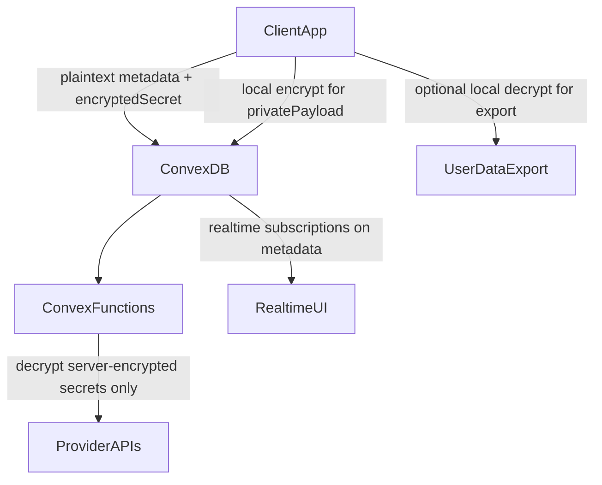

# Hybrid encryption plan preserving Convex realtime

## Goal and guardrails

- Keep Convex realtime sync, indexed queries, automations, and existing agent features intact.
- Encrypt sensitive values without forcing full E2EE everywhere.
- Add a simple landing-page feature claim that data is encrypted.

## Data classification first

- Create a field-by-field data classification pass for current tables in [convex/schema.ts](/Users/waynesutton/Documents/sites/humanagent/convex/schema.ts).
- Define 3 classes:
  - Plain metadata (index/search/realtime critical): owner IDs, timestamps, status, visibility, routing fields.
  - Server-encrypted secrets (backend must use): API keys, access tokens, refresh tokens, webhook secrets.
  - Client-E2EE private payloads (server never needs plaintext): optional user private notes/content vault fields.
- Output decision matrix in code comments near validators and helpers, not new docs files.

## Backend encryption hardening

- Replace base64 placeholder logic in [convex/functions/credentials.ts](/Users/waynesutton/Documents/sites/humanagent/convex/functions/credentials.ts) with authenticated encryption (AES-256-GCM envelope pattern).
- Add key version metadata (`keyVersion`, `alg`, `iv`, `tag`/combined payload format) on encrypted records.
- Load master key material from Convex environment variables only.
- Add internal helpers in a dedicated module (example target: [convex/lib/crypto.ts](/Users/waynesutton/Documents/sites/humanagent/convex/lib/crypto.ts)) and reuse from credential mutations/queries.
- Keep returned shapes masked exactly as today for public queries in credentials functions.

## Preserve Convex features by design

- Keep indexable/queryable fields plaintext in [convex/schema.ts](/Users/waynesutton/Documents/sites/humanagent/convex/schema.ts) so `.withIndex(...)`, realtime subscriptions, and filtering keep working.
- Do not encrypt fields used by routing, permission checks, status filtering, or list sorting.
- Encrypt payload fields only where full-text query is not required.

## User export strategy

- Add export API path that returns user-owned records with encrypted blobs and metadata.
- Support two export modes in product behavior:
  - Encrypted export (default safe archive).
  - Client-side decrypted export after local unlock for user-readable download.
- Keep ownership checks strict and index-based in Convex functions.

## Landing page feature update

- Update the features array in [src/pages/LandingPage.tsx](/Users/waynesutton/Documents/sites/humanagent/src/pages/LandingPage.tsx) to include a concise encryption feature line.
- Use short claim language per your choice: “Your data is encrypted.”
- Keep copy consistent with hybrid reality by avoiding misleading “everything is end-to-end encrypted” wording.

## Verification and rollout

- Validate type safety and function validators across changed Convex functions.
- Test critical flows: credential save/read/use, agent runtime integrations, realtime list pages, and export behavior.
- Add a key-rotation-ready shape now (versioned ciphertext), even if rotation job is phase 2.
