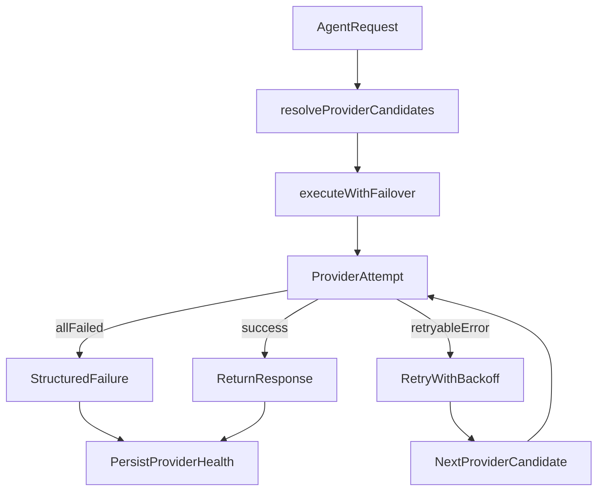

# Provider Failover Strategy For HumanAgent

## Goal

Apply your single resolver plus runtime failover pattern to this app’s actual AI path, which currently runs through `[convex/agent/runtime.ts](/Users/waynesutton/Documents/sites/humanagent/convex/agent/runtime.ts)` and `[convex/agent/queries.ts](/Users/waynesutton/Documents/sites/humanagent/convex/agent/queries.ts)`.
The scope is LLM provider failover only, not non-LLM BYOK integrations.

External reference clarification:

- `convex/aiReview.ts` and `convex/seoContent.ts` are from another codebase and are not target files for this app.
- Their role here is pattern inspiration only.
- The implementation goal in this app is provider failover strategy in the existing runtime and query paths.

## Where the strategy fits today

- Replace per call direct provider credential use in `[convex/agent/runtime.ts](/Users/waynesutton/Documents/sites/humanagent/convex/agent/runtime.ts)` with shared candidate resolution and execution wrappers.
- Extend existing credential layer in `[convex/functions/credentials.ts](/Users/waynesutton/Documents/sites/humanagent/convex/functions/credentials.ts)` and query layer in `[convex/agent/queries.ts](/Users/waynesutton/Documents/sites/humanagent/convex/agent/queries.ts)` to return ordered candidates instead of one provider only.
- Restrict resolver candidates to LLM services only: `openrouter`, `anthropic`, `openai`, `deepseek`, `google`, `mistral`, `minimax`, `kimi`, `xai`.
- Keep non-LLM BYOK services (`agentmail`, telephony, browser, supermemory, OAuth integrations) on their existing service-specific resolution paths.
- Add observability via a small provider health table in `[convex/schema.ts](/Users/waynesutton/Documents/sites/humanagent/convex/schema.ts)` and expose status in settings via `[src/pages/SettingsPage.tsx](/Users/waynesutton/Documents/sites/humanagent/src/pages/SettingsPage.tsx)`.
- Keep graceful degradation in existing UX paths that already display failed outcomes in board and chat views.

## Proposed architecture

## Implementation shape

- **Shared resolver**
  - Create `resolveLLMCandidates(...)` helper that returns ordered candidates:
    1. active configured provider from agent or user config
    2. other active DB credentials with valid key and model
    3. env Anthropic
    4. env OpenAI
    5. env Gemini if configured
  - Each candidate includes provider, apiKey, optional baseUrl, resolved model, and source (`db` or `env`).
  - Validate provider-model compatibility before attempting calls to avoid avoidable bad request failures.
  - Env fallback is optional and only used when enabled by policy; DB BYOK remains first priority.
  - Keep this centralized so runtime and future AI entry points reuse one source of truth.
- **Shared failover executor**
  - Create `executeWithFailover(candidates, callInput)` that loops candidates, applies per attempt timeout, classifies errors, retries retryable errors once or twice with short exponential backoff, then fails over.
  - Failover on runtime failures, not only missing key:
    - auth invalid key
    - rate limit
    - timeout or network
    - provider 5xx
  - Do not fail over for non retryable input or policy errors.
- **Circuit breaker and health**
  - Add table for provider health state with consecutive failures, open until timestamp, last error category and last status.
  - Before using candidate, skip provider when breaker open.
  - Update health after each attempt and reset on success.
- **Runtime integration**
  - In `[convex/agent/runtime.ts](/Users/waynesutton/Documents/sites/humanagent/convex/agent/runtime.ts)`, replace direct one provider call in `processMessage` and `autoGenerateGraph` with shared failover executor.
  - Add explicit `xai` routing in provider switch to avoid unintended default openai path.
  - Keep current response contract, but return structured failure metadata for UI retry actions.
- **Admin and UX visibility**
  - Add query endpoints to read provider health by user and provider.
  - Surface provider health and last errors in settings page.
  - Add retry trigger for failed AI jobs where task is failed and retry is safe.

## Files to change first

- `[convex/schema.ts](/Users/waynesutton/Documents/sites/humanagent/convex/schema.ts)`
- `[convex/agent/queries.ts](/Users/waynesutton/Documents/sites/humanagent/convex/agent/queries.ts)`
- `[convex/agent/runtime.ts](/Users/waynesutton/Documents/sites/humanagent/convex/agent/runtime.ts)`
- `[convex/functions/credentials.ts](/Users/waynesutton/Documents/sites/humanagent/convex/functions/credentials.ts)`
- `[src/pages/SettingsPage.tsx](/Users/waynesutton/Documents/sites/humanagent/src/pages/SettingsPage.tsx)`
- `[TASK.md](/Users/waynesutton/Documents/sites/humanagent/TASK.md)`
- `[changelog.md](/Users/waynesutton/Documents/sites/humanagent/changelog.md)`
- `[files.md](/Users/waynesutton/Documents/sites/humanagent/files.md)`

## Validation checklist

- Simulate invalid API key for primary provider and verify fallback to next candidate.
- Simulate 429 and 5xx and verify retry then provider failover.
- Simulate timeout and verify abort timeout plus fallback.
- Verify circuit breaker opens after N consecutive failures and auto closes after cooldown.
- Verify structured failure is returned when all candidates fail and UI remains usable.
- Verify settings page displays recent provider failures and breaker state.
